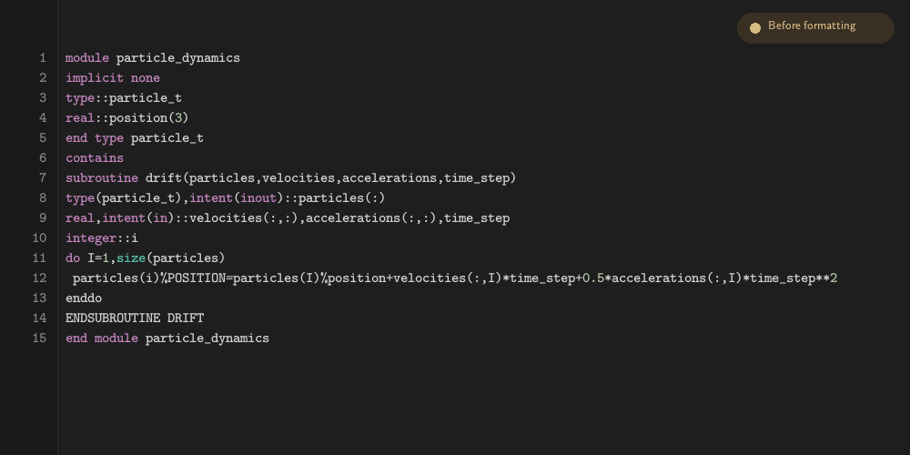

# forformat

[](https://github.com/cmbant/forformat/actions/workflows/ci.yml)
[](https://pypi.org/project/forformat/)

`forformat` is a standalone formatter for free-form Fortran. It combines findent-compatible
indentation with lexical normalization, project-aware identifier casing, and statement wrapping.
The formatter is implemented in Rust and designed for fast whole-project formatting. Python wheels
bundle `forformat`, so normal installation does not require Rust or a Fortran compiler.

<p align="center">
  
</p>

Automatic fixed/free input detection is enabled by default. Sources detected as fixed form are left
unchanged; use `-ifree` or `--input-format=free` to force free-form handling. Fixed-form output is
not supported.

## Install

From PyPI:

```sh
python -m pip install forformat
forformat --version
```

The package requires Python 3.9 or newer.

For pre-commit, use the separate hook repository:

```yaml
repos:
  - repo: https://github.com/cmbant/forformat-pre-commit
    rev: v0.1.5
    hooks:
      - id: forformat
      # - id: forformat-check  # check only; do not rewrite
```

To build from source, install Rust 1.85 or newer:

```sh
cargo build --locked --release
"${CARGO_TARGET_DIR:-target}/release/forformat" --version
```

Tagged release workflows also build static Linux archives for x86_64 and arm64. Checksums and
GitHub provenance attestations are included with release artifacts for users who want to verify
downloads; they are not required for normal PyPI or pre-commit installation.

## Quick start

Format files in place:

```sh
forformat src/module.f90
forformat src/*.f90
forformat src/
```

Explicit paths use declarations from the surrounding project for identifier case resolution; add
`--isolated` for standalone formatting.

Check formatting without changing files, or print a diff:

```sh
forformat --check src/*.f90
forformat --diff src/*.f90
```

Format every tracked free-form source in the current checkout:

```sh
forformat --all-files
```

Use stdin/stdout in a pipeline:

```sh
forformat --stdin < src/module.f90 > /tmp/module.f90
forformat --stdout src/module.f90 > /tmp/module.f90
```

For an editor buffer, give stdin the filename it represents:

```sh
forformat --stdin-filename=src/module.f90 < src/module.f90
```

The filename supplies configuration and Git-project discovery, source-form detection, relative
`INCLUDE` resolution, and diagnostics. If the file is tracked, the stdin bytes shadow its stale
on-disk contents during project analysis; the filename may also name a new file whose parent
already exists. Use `--project-context=/path/to/other/checkout` to override only the Git project
used for semantic context without changing the stdin filename or its configuration origin.

## Formatting modes

Full formatting is the default. The other modes are useful when you want a narrower transformation:

- `--full` — normalization, wrapping, and findent-compatible layout.
- `--indent-only` — findent-compatible indentation and trailing-whitespace handling only.
- `--normalize-only` — normalization without structural layout or wrapping.
- `--canonicalize-only` — canonical transformations without whitespace or layout normalization.
- `--canonicalize-and-indent` — canonical transformations followed by findent-compatible
  indentation, without wrapping or full-mode post-layout alignment.

Normalizing modes target Fortran 2003 output by default. Use `--target-standard=f95` (or
`target_standard = "f95"` in configuration) to prevent the formatter from introducing syntax newer
than Fortran 95. The target constrains formatter-generated syntax; it does not validate or downgrade
syntax already present in the input.

Common examples:

```sh
forformat --indent=4 --indent-module=0 --indent-procedure=0 src/module.f90
forformat --keyword-case=upper --line-length=100 src/module.f90
forformat --canonicalize-and-indent src/module.f90
```

See **[CLI and configuration options](docs/options.md)** for the full option reference, defaults,
configuration keys, and examples. Legacy findent spellings that are only useful for compatibility
are documented separately in [migration](docs/migration.md) and
[compatibility](docs/compatibility.md). `forformat --help` is the compact terminal summary.

## Project configuration

Project settings can live in a top-level `.forformat.toml`, the compatibility spelling
`.findent.toml`, or `[tool.forformat]` in `pyproject.toml`:

```toml
[tool.forformat]
mode = "full"
target_standard = "f2003"
indent = 4
line_length = 100
keyword_case = "lower"
context_paths = ["src", "modules"]
exclude = ["vendor/"]
extend_exclude = ["**/generated-*.f90"]
```

Hyphens and underscores are equivalent in configuration keys. Command-line scalar options override
project settings. `--exclude` replaces the configured exclusion set; `--extend-exclude` adds to it.
Workflow choices such as `--all-files`, `--check`, `--diff`, `--stdin`, and `--stdout` remain
command-line-only. See [the options reference](docs/options.md#configuration) for discovery,
precedence, and the full list of command-line-only settings.

## Python API

Python callers can format text or bytes using the same formatter shipped with the package:

```python
from forformat import format_source

formatted = format_source(
    source,
    filename="/path/to/checkout/src/module.f90",
    options=("--config=/absolute/path/to/.forformat.toml",),
)
```

The return type matches the input type. `filename` gives an in-memory buffer the same file identity
as `--stdin-filename`; `repo_context_path` can optionally override its project with a directory.
Automatic configuration discovery is disabled for this API unless `options` explicitly supplies
`--config`.

## Documentation

- [CLI and configuration options](docs/options.md) — primary user-facing option reference.
- [File and project workflow](docs/file-workflow.md) — tracked-file selection, project context,
  exclusions, submodules, stdin identity, and fixed/free detection.
- [VS Code setup](docs/vscode.md) — configure the Fortran extension to use `forformat`.
- [Full-mode guide](docs/full-mode.md) — normalization, wrapping, layout, invariants, and code map.
- [Compatibility](docs/compatibility.md) — the findent compatibility boundary and reviewed
  divergences.
- [Migrating from findent](docs/migration.md) — legacy option mapping and unsupported features.

## Development

The implementation is under `src/`; tests and golden fixtures are under `tests/`. Run:

```sh
./tools/check_local.sh
```

For dependency-policy changes, CI also runs `cargo deny check bans licenses sources`; RustSec
advisories are reported separately so a newly published advisory does not unexpectedly block an
otherwise unrelated pull request.

For changes to full-mode normalization, wrapping, or layout, also run
`./tools/check_fuzz_regression.sh` and the relevant focused properties. See [`AGENTS.md`](AGENTS.md)
for the full repository verification bar.

## Relationship to findent

`--indent-only` implements the findent-compatible indentation contract for findent 4.3.8~pre01;
full mode intentionally adds behavior beyond that contract. See
[compatibility](docs/compatibility.md) for the reviewed differences and
[migration](docs/migration.md) for legacy option mapping.

The project is BSD-3-Clause licensed. Third-party attribution and license terms are in
[`LICENSE-THIRD-PARTY`](LICENSE-THIRD-PARTY).
